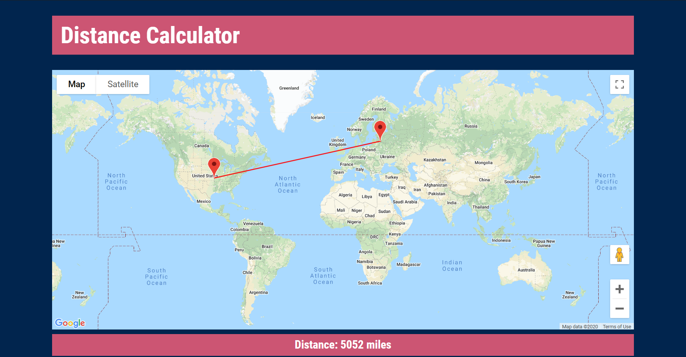

# Distance Calculator
### About
This website allows a user to calculate the distance (in miles) between any two places on the globe. It uses the Google Maps API to display a map to the user so that they can click on two points and see the distance between them as the crow flies.
### Motivation
I had been wanting to create something using the Google Maps API for quite a while and after having a conversation about how many miles Australia is from the UK, I thought it would be interesting to be able to calculate the distance between any two points on the globe. Creating this project also allowed me to improve upon my skills in Javascript, which is something I had been eager to do for a while.
### Screenshots

### API used
-	Google Maps Javascript API (https://developers.google.com/maps/documentation/javascript/overview)

